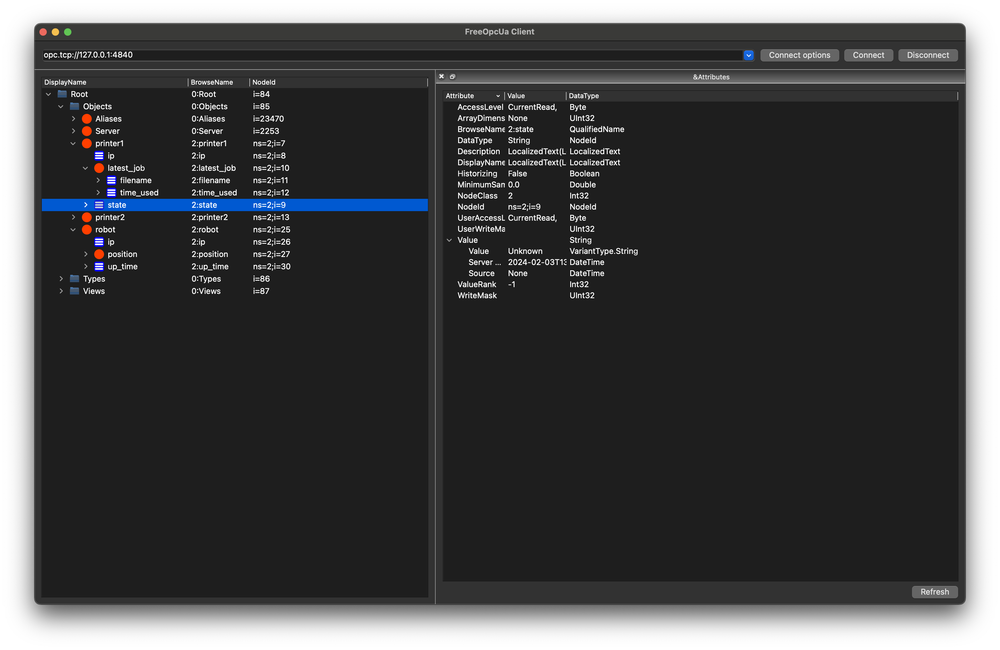

# opcuax

A simple OPC UA library based on [opcua-asyncio](https://opcua-asyncio.readthedocs.io/en/latest/)
and [Pydantic](https://docs.pydantic.dev/latest/).

## Code Examples

* [Server](./examples/server.py)
* [Client](./examples/client.py)
* [Cache](./examples/redis_cache.py)
* [Full code](./examples/tutorial.py) of [Getting Started](#getting-started) section

## Getting Started

Suppose we want to run an OPC UA server to record latest data of printers and robots in the lab:

* Printers
    * ip address
    * current state
    * latest job (time used in seconds, filename)
* Robot
    * ip address
    * current position (`(x, y)` both in range `[-200, 200]`)
    * uptime (in seconds)

### Create Models

We first convert the requirement to Python classes using Pydantic `BaseModel`.

```python
from typing import Annotated

from pydantic import BaseModel, NonNegativeInt, Field, IPvAnyAddress

LabPos = Annotated[float, Field(ge=-200, le=200, default=0)]


class Trackable(BaseModel):
    ip: IPvAnyAddress = IPvAnyAddress("127.0.0.1")


class Position(BaseModel):
    x: LabPos
    y: LabPos


class Job(BaseModel):
    filename: str = ""
    time_used: NonNegativeInt


class Printer(Trackable):
    state: str = "Unknown"
    latest_job: Job


class Robot(Trackable):
    position: Position
    up_time: NonNegativeInt = 0
```

#### Important

You cannot declare **nullable** types because OPC UA doesn't support `null` value for variables and objects.
`opcuax` set default values for primitive types (`str -> ""`, `int -> 0`, `float -> 0`, `bool -> False`),
but it is recommended that you declare meaningful default values in classes.

### Declare OPC UA Objects

Next we create a subclass of `OpcuaObjects` to represent objects we want to crate in the OPC UA server.

```python
from opcuax.models import OpcuaObjects


class Lab(OpcuaObjects):
    printer1: Printer
    printer2: Printer
    robot: Robot
```

### Setup Server

To create a server, we need to specify an endpoint, name of the server and a namespace uri for our objects.
This can be done by either using a settings object:

```python
from opcuax import OpcuaServer
from opcuax.settings import OpcuaServerSettings

settings = OpcuaServerSettings(
    opcua_server_url="opc.tcp://localhost:4840",
    opcua_server_name="Opcua Lab Server",
    opcua_server_namespace="https://github.com/monash-automation/opcuax",
)
server = OpcuaServer.from_settings(settings)
```

Or using environment variables or a `.env` file:

```.dotenv
OPCUA_SERVER_URL='opc.tcp://localhost:4840'
OPCUA_SERVER_NAME='Opcua Lab Server'
OPCUA_SERVER_NAMESPACE='https://github.com/monash-automation/opcuax'
```

```python
from opcuax import OpcuaServer

server = OpcuaServer.from_env(env_file=".env")
```

With a server we can create printer and robot objects

```python
from opcuax import OpcuaServer


async def create_objects(server: OpcuaServer):
    async with server:
        await server.create_objects(Lab)

        await server.loop()
```

Now you can verify objects creation by connecting the endpoint in your OPC UA client,
or try [opcua-client-gui](https://github.com/FreeOpcUa/opcua-client-gui) if you don't have one.



#### Important

You must call `create_objects` inside an `async with` block, which is required by the
server to prepare itself (init variables, setup endpoint, register namespace, listen to target port...).

#### Read and Update Object Values

We can call `read_objects` to get latest values of all objects,
and call `update_objects` to update the server after local modification.

```python
from opcuax import OpcuaServer


async def create_objects(server: OpcuaServer):
    async with server:
        await server.create_objects(Lab)

        lab = await server.read_objects(Lab)
        print(lab.model_dump_json())

        lab.robot.position = Position(x=100.0, y=100.0)
        await server.update_objects(lab)

        await server.loop()
```

### Client

Similar to server, we can create a client by either using a settings object:

```python
from opcuax import OpcuaClient
from opcuax.settings import OpcuaClientSettings

settings = OpcuaClientSettings(
    opcua_server_url="opc.tcp://localhost:4840",
    opcua_server_namespace="https://github.com/monash-automation/opcuax",
)
client = OpcuaClient.from_settings(settings)
```

Or by using environment variables or a `.env` file

```dotenv
OPCUA_SERVER_URL='opc.tcp://localhost:4840'
OPCUA_SERVER_NAMESPACE='https://github.com/monash-automation/opcuax'
```

```python
from opcuax import OpcuaClient

client = OpcuaClient.from_env(env_file=".env")
```

#### Read and Update Object Values

This part is almost same as working with a server, except that you don't need to
include all objects in the `OpcuaObjects` class unless you need to work with all of them.

```python
from opcuax import OpcuaClient, OpcuaObjects


class Printers(OpcuaObjects):
    printer1: Printer
    robot: Robot


async def run_client(client: OpcuaClient):
    # wait until server is ready if you run server and client in one program
    await asyncio.sleep(2)

    async with client:
        printers = await client.read_objects(Printers)
        print(printers.model_dump_json())

        printers.printer1.state = "Printing"
        printers.printer1.latest_job.filename = "A.gcode"
        await client.update_objects(printers)
```

## TODO

* [ ] Only update outdated node
* [ ] Only read/write selected object by `Lab.printer1`
* [ ] Concurrent friendly API

## Resources

* [OPC UA Document](https://reference.opcfoundation.org/)
    * [AddressSpace](https://reference.opcfoundation.org/Core/Part1/v105/docs/6.3.4)
    * [NodeId](https://reference.opcfoundation.org/DI/v104/docs/3.3.2.1)
    * [FolderNode](https://reference.opcfoundation.org/Core/Part3/v104/docs/5.5.3#_Ref131474245)
    * [Nested Objects](https://github.com/FreeOpcUa/opcua-asyncio/issues/185#issuecomment-627752985)
