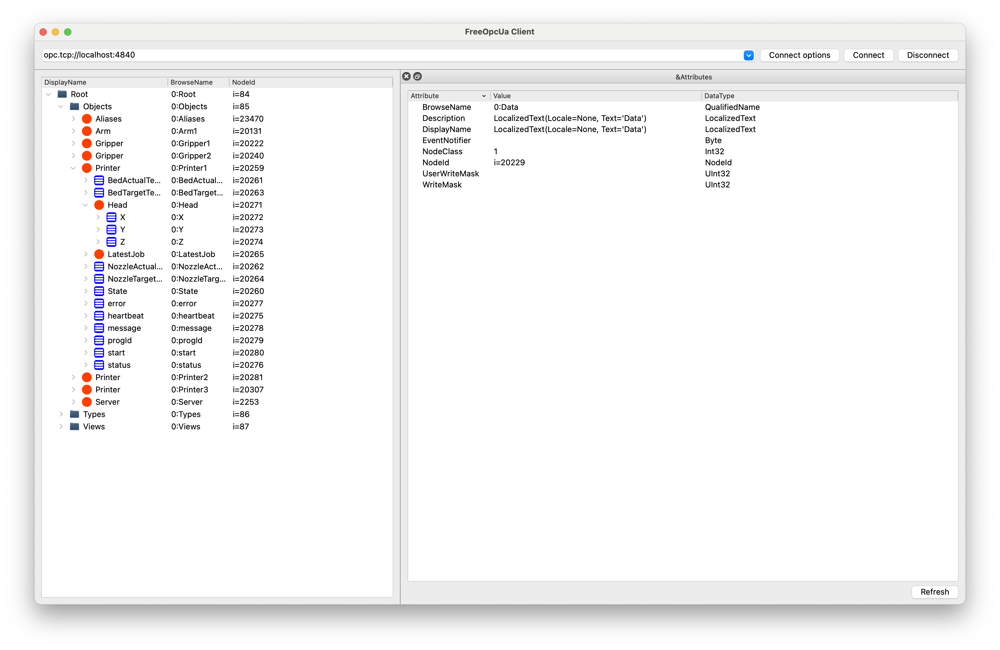

# OPC UA Server

## Build

Install dependencies by poetry

```shell
pip install poetry
poetry install
```

## Run

```shell
poetry run start
```

Connect to `opc.tcp://localhost:4840` with your OPC UA client.



## Config

The [objects.toml](./objects.toml) contains metadata for object nodes.
I chose [TOML](https://toml.io/en/) because it is more human friendly than YAML and JSON.

`Base` (base class) contains fields for all server objects.

```toml
[Base]
heartbeat = 0
status = "offline"
```

`Printer.Control` contains fields for a nested field named `Control`.

```toml
[Printer.Control]
PartRemoved = false
BedCleaned = false
File = "Unknown"
```

This is equivalent to the Python code below:

```python
class PrinterControl:
    PartRemoved = False
    BedCleaned = False
    File = "Unknown"


class Printer:
    Control = PrinterControl()
```

`instance.numbers` contains number of instances you want to create for each class.

```toml
[instances.numbers]
Printer = 3
```

## Contribute

Fork the project and clone.

Config Git with your username and email.

```shell
git config --global user.name 'your name'
git config --global user.email 'your email'
```

Install pre-commit hooks

```shell
pip install pre-commit
pre-commit install
```

Code and commit.

Push the branch and submit a pull request.

## Resources

* [OPC UA Document](https://reference.opcfoundation.org/)
    * [AddressSpace](https://reference.opcfoundation.org/Core/Part1/v105/docs/6.3.4)
    * [NodeId](https://reference.opcfoundation.org/DI/v104/docs/3.3.2.1)
    * [FolderNode](https://reference.opcfoundation.org/Core/Part3/v104/docs/5.5.3#_Ref131474245)
* [Book from qiyuqi](https://qiyuqi.gitbooks.io/opc-ua/content/Part3/Chapter4.html)

## Future

* Move endpoint and server name to `.env` file
* Use Pydantic classes
  as [object node declaration](https://github.com/monash-automation/mes-printing-server/blob/main/src/opcuax/objects.py)
* [Record history Data](https://github.com/FreeOpcUa/opcua-asyncio/blob/master/examples/server-datavalue-history.py)
