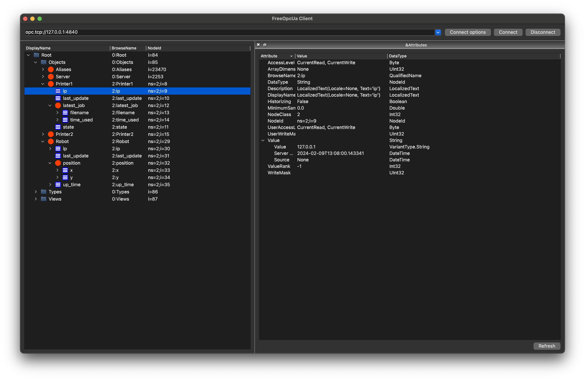

# opcuax

A simple OPC UA library based on [opcua-asyncio](https://opcua-asyncio.readthedocs.io/en/latest/)
and [Pydantic](https://docs.pydantic.dev/latest/).

## Code Examples

* [Server](./examples/server.py)
* [Client](./examples/client.py)
* [Cache](./examples/redis_cache.py)
* [Full code](./examples/tutorial.py) of [Getting Started](#getting-started) section

## Getting Started

Suppose we want to run an OPC UA server to record latest data of printers and robots in the lab:

* Printers
    * ip address
    * last update time
    * current state
    * latest job (time used in seconds, filename)
* Robot
    * ip address
    * last update time
    * current position (`(x, y)` both in range `[-200, 200]`)
    * uptime (in seconds)

### Create Models

We first convert the requirement to Python classes using Pydantic `BaseModel`.

Note we extend class `OpcuaModel` in `Printer` and `Robot`
(through a base class `Trackable` to reuse common fields).
`opcuax` will treat `OpcuaModel` subclasses as OPC UA object types for object node creation.
`OpcuaModel` itself is a subclass of `BaseModel` with all Pydantic features.

```python
from datetime import datetime
from typing import Annotated

from pydantic import BaseModel, NonNegativeInt, Field, IPvAnyAddress, PastDatetime

from opcuax import OpcuaModel

UpdateTime = Annotated[datetime, PastDatetime()]


class Trackable(OpcuaModel):
    ip: IPvAnyAddress = "127.0.0.1"
    last_update: UpdateTime = Field(default_factory=datetime.now)


class Position(BaseModel):
    x: LabPos = 0
    y: LabPos = 0


class Job(BaseModel):
    filename: str = ""
    time_used: NonNegativeInt = 0


class Printer(Trackable):
    state: str = "Unknown"
    latest_job: Job = Job()


class Robot(Trackable):
    position: Position = Position()
    up_time: NonNegativeInt = 0
```

### Setup Server

To create a server, we need to specify an endpoint, name of the server and a namespace uri for our objects.
This can be done by either using a settings object:

```python
from opcuax import OpcuaServer, OpcuaServerSettings

settings = OpcuaServerSettings(
    opcua_server_url="opc.tcp://localhost:4840",
    opcua_server_name="Opcua Lab Server",
    opcua_server_namespace="https://github.com/monash-automation/opcuax",
)
server = OpcuaServer.from_settings(settings)
```

Or using environment variables or a `.env` file:

```.dotenv
OPCUA_SERVER_URL='opc.tcp://localhost:4840'
OPCUA_SERVER_NAME='Opcua Lab Server'
OPCUA_SERVER_NAMESPACE='https://github.com/monash-automation/opcuax'
```

```python
from opcuax import OpcuaServer

server = OpcuaServer.from_env(env_file=".env")
```

With a server we can create a printer object by calling `server.create`.
The server will return an **enhanced** model of the printer which maintains
OPC UA node information.

```python

from examples.tutorial import Printer, Robot
from opcuax import OpcuaServer


async def main(server: OpcuaServer):
    async with server:
        # Create objects under node "0:/Root/0:Objects"
        # Create an object of type Printer named Printer1
        printer1: Printer = await server.create("Printer1", Printer())
        print(type(printer1))  # <class 'opcuax.model._OpcuaxPrinter'>
        print(type(printer1).__bases__)  # (<class '__main__.Printer'>, <class 'opcuax.model.EnhancedModel'>)
        assert isinstance(printer1, Printer)

        await server.create("Printer2", Printer())
        await server.create("Robot", Robot())

        await server.loop()
```

`opcuax` creates an enhanced class for each `OpcuaModel` at runtime to integrate OPC UA node operations.
This is same as:

```python
from examples.tutorial import Printer
from opcuax.model import EnhancedModel


class _OpcuaxPrinter(Printer, EnhancedModel):
    pass
```

You must use the enhanced model to call server/client APIs.

Now you can verify objects creation by connecting the endpoint in your OPC UA client,
or try [opcua-client-gui](https://github.com/FreeOpcUa/opcua-client-gui) if you don't have one.



Also check 2 created object types under `0:Root/0:Types/0:ObjectTypes/0:BaseObjectType`


**Important**: You must call `create_objects` inside an `async with` block, which is required by the
server to prepare itself (init variables, setup endpoint, register namespace, listen to target port...).

### Read All Fields of an Object

The returned enhanced model contains a snapshot of all node values in the server.
If you want to get the latest value, call `refresh` with the enhanced model.

Note: the argument must be a model which has a corresponding object node in the server.
Trying to refresh a variable (for example `printer1.state`) is invalid.

```python
from examples.tutorial import Printer
from opcuax import OpcuaServer


async def read_object(server: OpcuaServer):
    printer1: Printer = await server.create("Printer1", Printer())
    # refresh all values
    await server.refresh(printer1)
    # refresh a subset of nodes
    await server.refresh(printer1.latest_job)
```

### Update Single Field of an Object

The enhanced model remembers all value changes and will synchronize all changes to the server after
calling `server.commit`.

```python
from datetime import datetime

from examples.tutorial import Printer, Job
from opcuax import OpcuaServer


async def update_field(server: OpcuaServer):
    printer1: Printer = await server.create("Printer1", Printer())

    printer1.latest_job = Job(filename="A.gcode", time_used=100)
    printer1.last_update = datetime.now()
    printer1.state = "Printing"

    await server.commit()
```

### Update All Fields of an Object

If you want to update all fields of an `OpcuaModel`, use `server.update` instead of `printer1 = Printer()`.
The latter one makes variable `printer1` points to a new printer model and the enhanced model is not
accessible anymore.

```python
from opcuax import OpcuaServer
from examples.tutorial import Printer


async def update_all_nodes(server: OpcuaServer, model: Printer):
    await server.update("Printer1", model)
```

### Setup Client

Similar to server, we can create a client by either using a settings object:

```python
from opcuax import OpcuaClient, OpcuaClientSettings

settings = OpcuaClientSettings(
    opcua_server_url="opc.tcp://localhost:4840",
    opcua_server_namespace="https://github.com/monash-automation/opcuax",
)
client = OpcuaClient.from_settings(settings)
```

Or by using environment variables or a `.env` file

```dotenv
OPCUA_SERVER_URL='opc.tcp://localhost:4840'
OPCUA_SERVER_NAMESPACE='https://github.com/monash-automation/opcuax'
```

```python
from opcuax import OpcuaClient

client = OpcuaClient.from_env(env_file=".env")
```

### Read and Update Object Values

This part is same as working with a server, except you **cannot** create new object types,
or objects whose types is not included on the server.

```python
import asyncio

from examples.tutorial import Printer
from opcuax import OpcuaClient


async def main(client: OpcuaClient):
    # wait until server is ready if you run server and client in one program
    await asyncio.sleep(3)

    async with client:
        # Get an object from the server
        printer = await client.get_object(Printer, "Printer1")
        print(printer.model_dump_json())

        printer.latest_job.time_used += 10
        printer.state = "Finished"
        await client.commit()

        await client.refresh(printer)
```

## Contribute

Please open an issue before coding in case you waste time on unwanted changes,
and follow the [contribution guideline](./CONTRIBUTING.md)

## Resources

* [OPC UA Document](https://reference.opcfoundation.org/)
    * [AddressSpace](https://reference.opcfoundation.org/Core/Part1/v105/docs/6.3.4)
    * [NodeId](https://reference.opcfoundation.org/DI/v104/docs/3.3.2.1)
    * [FolderNode](https://reference.opcfoundation.org/Core/Part3/v104/docs/5.5.3#_Ref131474245)
    * [Nested Objects](https://github.com/FreeOpcUa/opcua-asyncio/issues/185#issuecomment-627752985)
